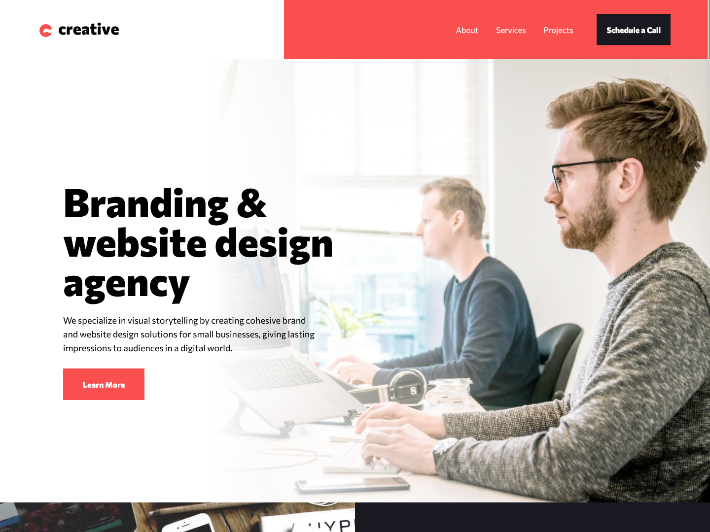

# Creative-singlepage-site
# Frontend Mentor - Creative agency single page site solution

This is a solution to the [Creative agency single page site challenge on Frontend Mentor](https://www.frontendmentor.io/challenges/creative-agency-singlepage-site-Pq6V3I2RM). Frontend Mentor challenges help you improve your coding skills by building realistic projects. 

### The challenge

Users should be able to:

- View the optimal layout for the site depending on their device's screen size
- See hover states for all interactive elements on the page
- Navigate the slider

### Screenshot

### Links

- Live Site URL: [Add Page](https://thignvs.github.io/Creative-singlepage-site/)

### Built with

- Semantic HTML5 markup
- CSS custom properties
- Flexbox
- CSS Grid
- Mobile-first workflow
- React JS
- Vite JS
- Tailwind CSS